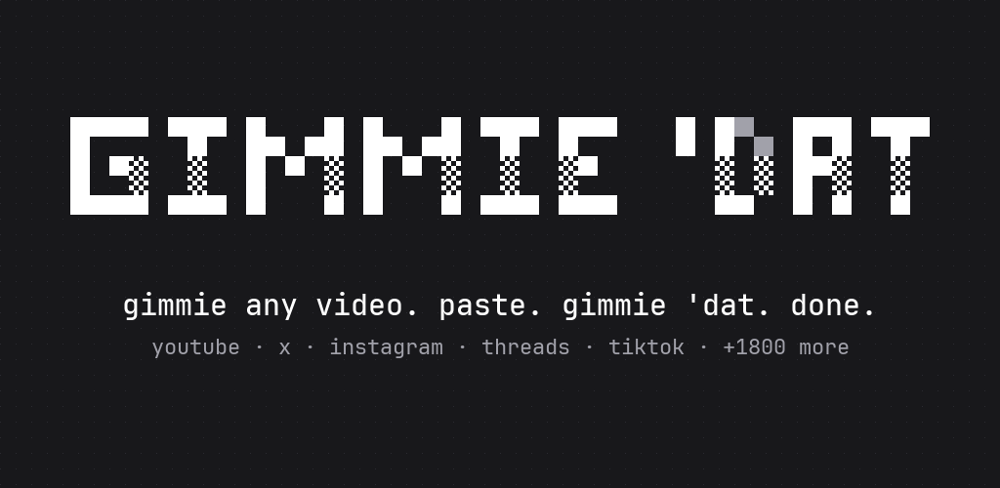

<p align="center"></p>

# Gimmie 'Dat

Save videos and audio from YouTube, Instagram, TikTok, X, Threads and the 1,800+ other sites
[yt-dlp](https://github.com/yt-dlp/yt-dlp) supports. Share a link to Gimmie 'Dat (or paste it), pick
a resolution or audio-only mp3, done.

## Install

- **APK:** grab `gimmiedat-<version>.apk` from [Releases](../../releases) and open it on your phone.
  Android asks once to allow installs from your browser or file manager. Needs Android 10 or newer
  on an arm64 phone (anything from the last several years).
- **Updates:** [Obtainium](https://github.com/ImranR98/Obtainium) can watch this repo and install new
  releases for you.
- **F-Droid:** coming soon. F-Droid signs its own build, so switching between it and the APK from
  Releases means uninstalling first.

## Using it

- **Share** a video from YouTube, Instagram, TikTok, X, a browser... and pick **Gimmie 'Dat**.
- Or open Gimmie 'Dat and paste. A copied link shows up as "link in your clipboard: tap to grab it".
- Or select a link anywhere and choose **Gimmie 'Dat** from the text menu.
- Files land in `Download/Gimmie 'Dat` and show up in Gallery, Files and music apps.
- Downloads keep going in the background, with progress and a cancel button in the notification.
- `◐ theme` cycles auto / light / dark. `? about` shows engine versions and an "update yt-dlp" button.

Everything ships inside the APK, so there is no Termux, Python install or setup:

| piece   | what it does                                     | source                          |
|---------|--------------------------------------------------|---------------------------------|
| yt-dlp  | the extractor (bundled 2026.08.19, updatable)    | `app/src/main/res/raw/ytdlp`    |
| python  | runs yt-dlp (3.12)                               | youtubedl-android 0.18.1        |
| ffmpeg  | merges hi-res video and audio, makes mp3s        | youtubedl-android ffmpeg 0.18.1 |
| QuickJS | solves YouTube's JavaScript challenges           | youtubedl-android 0.18.1        |

## Privacy

No ads, no trackers, no analytics, no account. The app only talks to the site you grab from (and its
thumbnail servers) and to GitHub, to fetch new yt-dlp releases. Release builds check GitHub once a
day and whenever a site stops working. Builds made with `-Pgimmiedat.autoUpdateYtDlp=false`, like the
F-Droid one, only check when you tap "update yt-dlp". Downloads and the recent list stay on your phone.

## Building

Needs JDK 17 and the Android SDK.

```sh
./gradlew assembleRelease                                      # arm64 APK in app/build/outputs/apk/release
./gradlew assembleRelease -Pgimmiedat.abis=arm64-v8a,x86_64    # also runs on a desktop emulator
./gradlew assembleRelease -Pgimmiedat.autoUpdateYtDlp=false    # yt-dlp updates only on request
```

Without a `keystore/` folder the release APK is unsigned. On Windows, `.\build.ps1` creates a signing
key on first run, runs the unit tests, builds, and copies the signed APK to `dist\`
(`-RefreshYtDlp` bundles the newest yt-dlp first, `-Install` adb-installs it). To keep a log, redirect
outside PowerShell: `cmd /c "powershell -File build.ps1 > build-log.txt 2>&1"`.

```
app/src/main/java/app/gimmiedat/
  engine/   Engine.kt (yt-dlp lifecycle, probe, download, updates)
            Choices.kt / Format.kt / Platforms.kt (format picking, labels, site detection)
  data/     MediaSaver (MediaStore → Download/Gimmie 'Dat), History, Prefs
  ui/       Logo (the pixel wordmark + shimmer), Components, Screens, Theme
  Grabber.kt          the input → probing → picking → downloading → done state machine
  DownloadService.kt  foreground service + notifications
```

## License

GPL-3.0 (see [LICENSE](LICENSE)), because it builds on
[youtubedl-android](https://github.com/JunkFood02/youtubedl-android) (GPL-3.0). It includes code and the
logo font ported from [yoinks](https://github.com/pablostanley/yoinks) (MIT, see
[LICENSE-yoinks-MIT.txt](LICENSE-yoinks-MIT.txt)). yt-dlp is Unlicense, JetBrains Mono is OFL-1.1
(see [licenses-JetBrainsMono-OFL.txt](licenses-JetBrainsMono-OFL.txt)), and Python, FFmpeg and QuickJS
come with youtubedl-android under their own licenses.

Gimmie 'Dat is a personal-archiving tool. Downloading content may violate a platform's terms of service.
Only download what you have the right to keep, and be excellent to creators.
