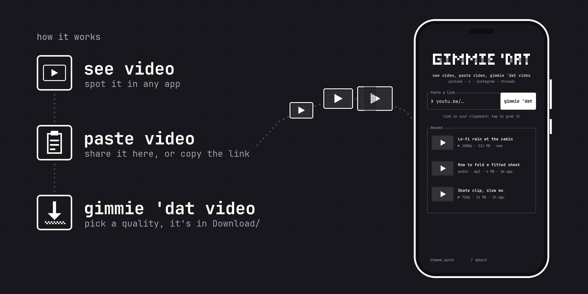

<p align="center">
  <picture>
    <source media="(prefers-color-scheme: dark)" srcset="assets/logo-dark.svg">
    
  </picture>
</p>

<p align="center"><b>see video, paste video, gimmie 'dat video</b></p>

<p align="center">
  <a href="https://github.com/rcrandon/gimmiedat/releases/latest"></a>
  
  <a href="LICENSE"></a>
  
</p>

Save videos and audio from YouTube, X, Instagram, Threads, TikTok and 1,800+ other sites, right on
your Android phone. Share a link to Gimmie 'Dat (or paste one), pick a resolution or audio-only mp3,
done. No ads, no account, no fake download buttons, no sketchy redirects.

<p align="center"></p>

## Install

1. Download **`gimmiedat-<version>.apk`** from the [latest release](https://github.com/rcrandon/gimmiedat/releases/latest)
   and open it on your phone.
2. Android asks once to allow installs from your browser or file manager. Allow it, then **Install**.
3. If Play Protect warns about an unknown developer, tap **More details**, then **Install anyway**.
   Gimmie 'Dat is signed with the project's own key, not a Play Store key.

Needs Android 10 or newer on an arm64 phone (anything from the last several years).
[Obtainium](https://github.com/ImranR98/Obtainium) can watch this repo and install updates for you.
An F-Droid release is on the way.

Google Play doesn't allow apps that download from YouTube and friends, so Gimmie 'Dat will not be on
the Play Store.

## Usage

- **Share** a video from YouTube, TikTok, Instagram, X, a browser... and pick **Gimmie 'Dat**.
- Or open the app and paste. A link you copied shows up as *link in your clipboard: tap to grab it*.
- Or select a link anywhere and choose **Gimmie 'Dat** from the text selection menu.

Pick a resolution (each with an estimated size) or **audio only (mp3)**, and the file lands in
`Download/Gimmie 'Dat`, where Gallery, Files and your music app find it. Downloads keep going in the
background, with progress and a cancel button in the notification. Share a second link while one is
running and it's queued up next.

The recent list replays, shares, copies or re-grabs anything you've saved. `◐ theme` cycles auto,
light and dark. `? about` shows the engine versions and an **update yt-dlp** button.

## How it works

- **[yt-dlp](https://github.com/yt-dlp/yt-dlp)** does the extracting. A recent release
  (2026.08.19) ships inside the APK, and the app checks GitHub for a newer one once a day and
  whenever a site stops working, so it keeps up with site changes without an app update.
- **Python 3.12, FFmpeg and QuickJS** come from
  [youtubedl-android](https://github.com/JunkFood02/youtubedl-android) and run on the phone. FFmpeg
  merges high-resolution video with its audio and makes the mp3s; QuickJS solves YouTube's
  JavaScript challenges. No Termux, no setup.
- **The interface** is Kotlin and Jetpack Compose, styled like a terminal: light, dark and auto
  palettes, a one-tap format picker, and the pixel logo with its flicker-in intro and shimmer.
- **Files** are written through MediaStore, so no storage permission is needed, and a foreground
  service keeps long downloads alive when you leave the app.

## Privacy

No ads, no trackers, no analytics, no account. The app only talks to the site you grab from (and
its thumbnail servers) and to GitHub, to fetch new yt-dlp releases. Downloads and the recent list
never leave your phone. Builds made with `-Pgimmiedat.autoUpdateYtDlp=false`, like the F-Droid one,
only contact GitHub when you tap **update yt-dlp**.

## Building

Needs JDK 17 and the Android SDK.

```sh
./gradlew assembleRelease                                      # arm64 APK in app/build/outputs/apk/release
./gradlew assembleRelease -Pgimmiedat.abis=arm64-v8a,x86_64    # also runs on a desktop emulator
./gradlew assembleRelease -Pgimmiedat.autoUpdateYtDlp=false    # yt-dlp updates only on request
./gradlew testReleaseUnitTest                                  # format picker and parsing tests
```

Without a `keystore/` folder the release APK is unsigned. On Windows, `.\build.ps1` creates a signing
key on first run, runs the tests, builds, and copies the signed APK to `dist\` (`-RefreshYtDlp` bundles
the newest yt-dlp first, `-Install` adb-installs it). To keep a log, redirect outside PowerShell:
`cmd /c "powershell -File build.ps1 > build-log.txt 2>&1"`.

```
app/src/main/java/app/gimmiedat/
  engine/   Engine.kt (yt-dlp lifecycle, probe, download, updates)
            Choices.kt / Format.kt / Platforms.kt (format picking, labels, site detection)
  data/     MediaSaver (MediaStore → Download/Gimmie 'Dat), History, Prefs
  ui/       Logo (the pixel wordmark + shimmer), Components, Screens, Theme
  Grabber.kt          the input → probing → picking → downloading → done state machine
  DownloadService.kt  foreground service + notifications
```

## Roadmap

- [x] Share sheet, paste and text-selection entry points
- [x] Every resolution with size estimates, plus audio-only mp3
- [x] Playlists, background downloads, a queue for the next link
- [x] yt-dlp updates without an app update
- [ ] F-Droid release
- [ ] 32-bit ARM and x86_64 builds
- [ ] Choose the download folder
- [ ] Subtitles
- [ ] Translations

Something broke on a site? [Open an issue](https://github.com/rcrandon/gimmiedat/issues/new/choose)
with the link and the yt-dlp version from `? about`. Most of the time **update yt-dlp** already fixes it.

## Built with

[yt-dlp](https://github.com/yt-dlp/yt-dlp) and [youtubedl-android](https://github.com/JunkFood02/youtubedl-android)
do the heavy lifting. Type is [JetBrains Mono](https://www.jetbrains.com/lp/mono/).

## A note on fair use

Gimmie 'Dat is a personal-archiving tool. Downloading content may violate a platform's terms of
service. Only download what you have the right to keep, and be excellent to creators.

## License

[GPL-3.0](LICENSE), because it builds on youtubedl-android (GPL-3.0). Some code and the pixel font
are MIT-licensed ([notice](LICENSE-yoinks-MIT.txt)). yt-dlp is Unlicense, JetBrains Mono is OFL-1.1
([license](licenses-JetBrainsMono-OFL.txt)), and Python, FFmpeg and QuickJS come with
youtubedl-android under their own licenses.
